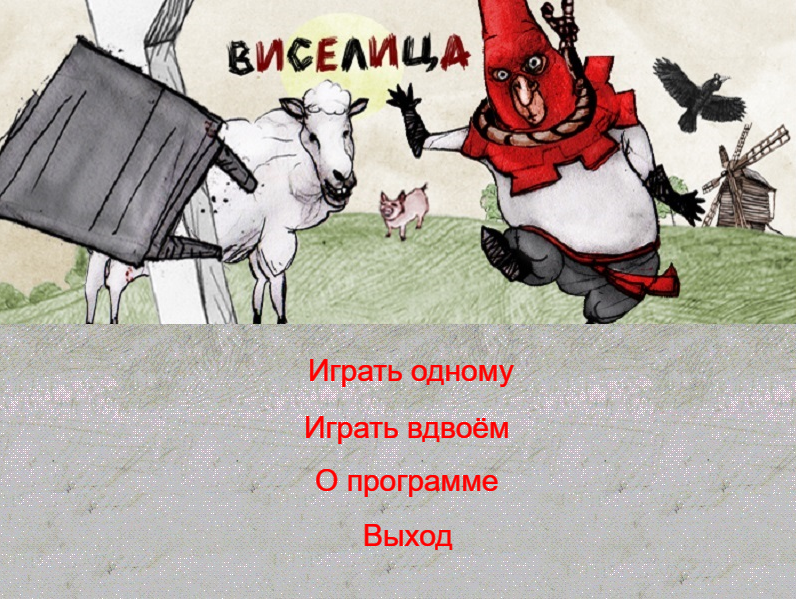
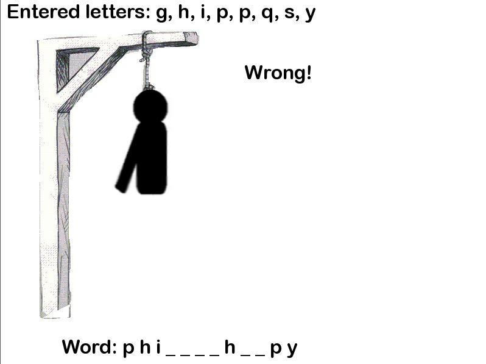

# Hangman
Classic hangman game with GUI and music.

## Screenshots

| Main menu                                                        |
|------------------------------------------------------------------|
|  |

| In game                                                          |
|------------------------------------------------------------------|
|            |

| End game                                                         |
|------------------------------------------------------------------|
|                      |

## Download

Compiled game file with SFML dlls can be found [here](https://github.com/Vasar007/Hangman/tree/master/bin).

## Compiling

This project needs in SFML v2.4 and C++11.

## License information

This project is licensed under the terms of the [MIT License](LICENSE).\
SFML is licensed under the terms of the [zlib/png license](https://www.sfml-dev.org/license.php).
